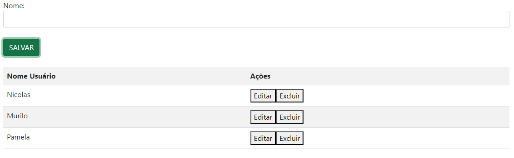
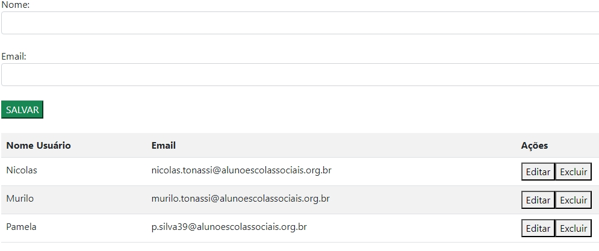

# login-cad
 
## Introdução
Este projeto é uma aplicação web simples que permite aos usuários se cadastrarem e fazerem login. A aplicação foi desenvolvida utilizando HTML, CSS (via Bootstrap) e JavaScript. O objetivo principal deste projeto é entender e implementar funcionalidades básicas de cadastro e login de usuários.
 
O projeto consiste em duas páginas principais:
 
- Página de Cadastro (cadastro.html): Permite que os usuários insiram seus nomes e os armazenem em uma lista.
 
- Página de Login (login.html): Permite que os usuários insiram seu e-mail e senha para acessar a página de cadastro.

 
## Funcionalidade dos códigos JavaScript
- Validação de login:
function acessar(){
    let loginEmail = document.getElementById('loginEmail').value;
    let loginSenha = document.getElementById('loginSenha').value;
 
    if(!loginEmail || !loginSenha){
        alert("Favor preencher todos os campos");
    }else{
        window.location.href = 'cadastro.html';
    }
}
 
Explicação: Esta função é acionada quando o usuário clica no botão "ACESSAR" na página de login. Ela verifica se os campos de e-mail e senha estão preenchidos. Se algum dos campos estiver vazio, um alerta solicita ao usuário que preencha todos os campos. Se ambos os campos estiverem preenchidos, o usuário é redirecionado para a página de cadastro.
 
 
- Salvando nomes de usuários:
var dadosLista = [];
 
function salvarUser(){
    let nomeUser = document.getElementById('nomeUser').value;
    if(nomeUser){
        dadosLista.push(nomeUser);
        criaLista();
        document.getElementById('nomeUser').value = "";
    }else{
        alert("Favor informe um nome para cadastro");
    }
}
 
Explicação: Esta função salva o nome inserido pelo usuário em um array (dadosLista). Se o campo de nome não estiver vazio, o nome é adicionado ao array, a lista é atualizada e o campo de entrada é limpo. Se o campo de nome estiver vazio, um alerta solicita ao usuário que insira um nome.
 
 
- Criando a lista de usuários:function criaLista(){
    let tabela = document.getElementById('tabela').innerHTML = "<tr><th>Nome Usuário</th><th>Ações</th></tr>";
    for(let i=0;i<=(dadosLista.length - 1);i++){
        tabela += "<tr><td>" + dadosLista[i] + "</td><td><button type='button' onclick='editar(parentNode.parentNode.rowIndex)'>Editar</button><button type='button' onclick='excluir(parentNode.parentNode.rowIndex)'>Excluir</button></td></tr>";
        document.getElementById('tabela').innerHTML = tabela;
    }
}
 
Explicação: Esta função atualiza a tabela na página de cadastro com a lista atual de nomes de usuários. Ela percorre o array dados Lista e gera linhas de tabela dinamicamente, com botões "Editar" e "Excluir" para cada usuário.
 
- Editando nomes de usuários:
function editar(i){
    document.getElementById('nomeUser').value = dadosLista[(i - 1)];
    dadosLista.splice(dadosLista[(i - 1)], 1);
}
 
Explicação: Esta função permite que o usuário edite um nome na lista. Quando o botão "Editar" é clicado, o nome selecionado é carregado no campo de entrada para edirão, e a entrada original é rem la lista.
 
 
- Excluindo Nomes de usuários:
function excluir(i){
    dadosLista.splice((i - 1), 1);
    document.getElementById('tabela').deleteRow(i);
}
 
Explicação: Esta função exclui um nome de usuário da lista quando o botão "Excluir" é clicado. A entrada selecionada é removida tanto do array quanto da tabela.
 

- Validação de E-mail:
function validarEmail(email) {
    var re = /^[a-zA-Z0-9._-]+@[a-zA-Z0-9.-]+\.[a-zA-Z]{2,4}$/;
    return re.test(String(email).toLowerCase());
}
 
Explicação: Esta função valida o formato do e-mail inserido pelo usuário. A validação é feita utilizando uma expressão regular que verifica se o e-mail está no formato correto (por exemplo, nome@dominio.com). Se o e-mail não estiver no formato correto, a função retorna false e o usuário é alertado para inserir um e-mail válido.

 
## Tecnologias utilizadas
- Visual Studio Code;
- HTML5;
- CSS3;
- GitHub;
- Git;
- JavaScript
 
 
## Autores
- [Nicolas Tonassi](https://github.com/nicolas-tonassi)
- [Murilo Tonassi](https://github.com/murilo-tonassi)
- [Pamela Souza](https://github.com/PamelaSouzaSilva)